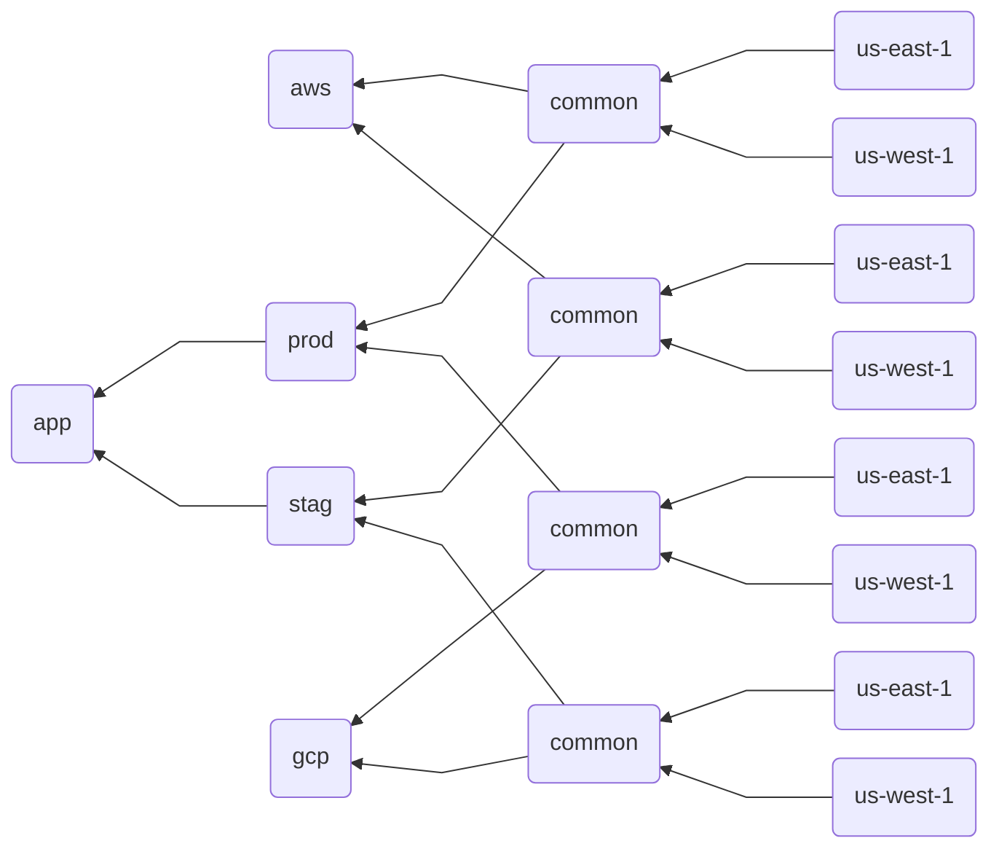
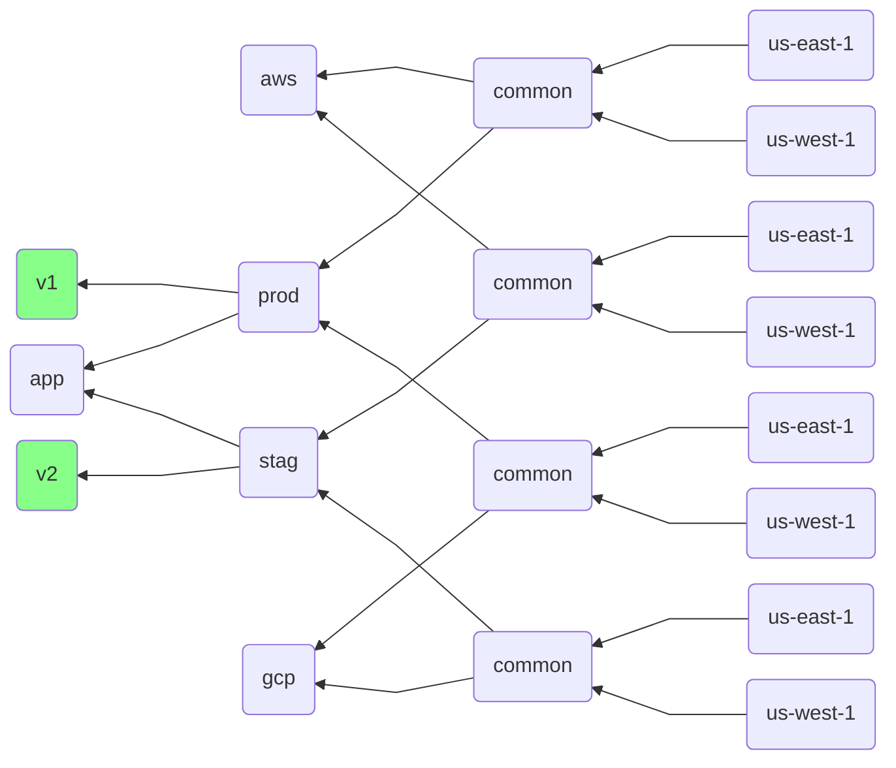
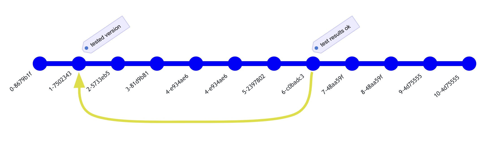
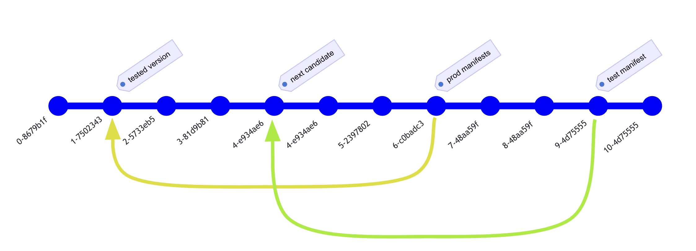
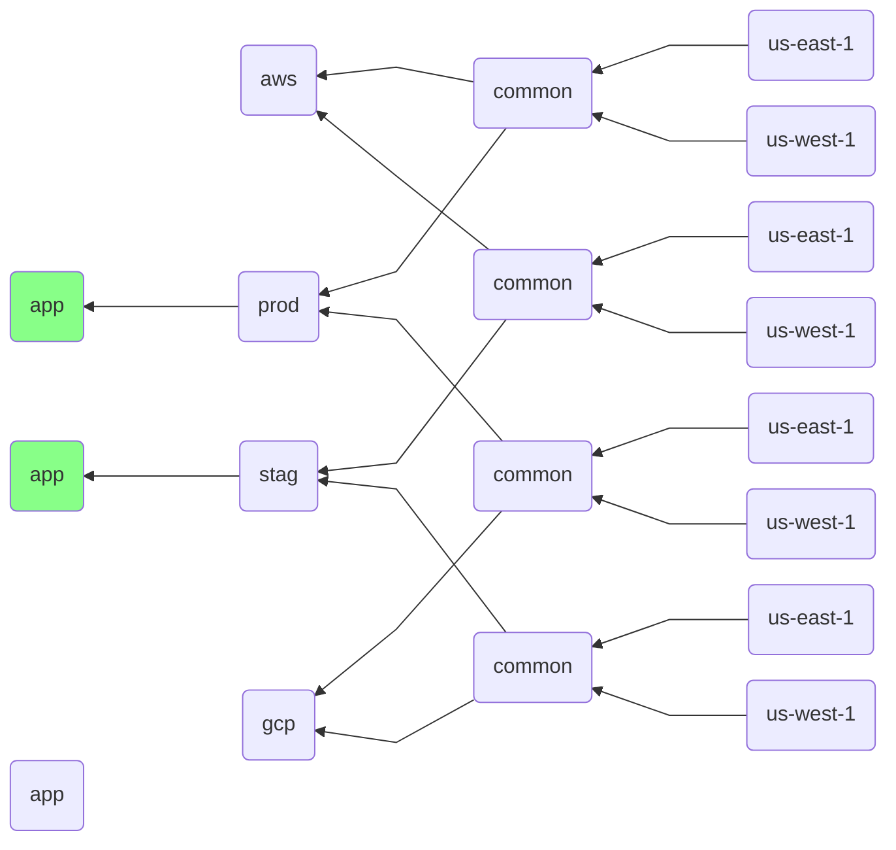

# RFC04: srcfs: Back to the feature

## Background

Jsonnet and Kubecfg shine when you have multiple variants or flavours of the same deployment templates, each tailored for a different environment.

Unfortunately, it's hard to evolve different environments over time safely.

In this background section I'll spend some time showing how one would "normally" organize a kubecfg Jsonnet codebase to deploy some software first to a staging enviornment and then to a production enviornment. I noticed we don't have any documentation in the kubecfg repo that describes what I think is a common pattern.

In the next section I'll present why this pattern is problematic.
### Scenario

A common way to model an entire deployment system with kubecfg is to create an _entrypoint_ jsonnet file for each of the target instances of the deployment.
Each entrypoint imports the flavour of the shared template it needs.
The entrypoint can then apply some further overlays that are specific to the target environment.

Each entrypoint describes exactly what you want your target cluster to look like at each point in time.
Whenever you want to change something (e.g. add more resources) to a cluster, you just make some changes in the Jsonnet files which result in the desired output being produced when rendering the Jsonnet templates in the target cluster(s).

This is just a simplified example of a directory structure you may end up having:

```console
$ tree
.
├── app
│   └── app.jsonnet
└── deploy
    ├── clusters
    │   ├── prod
    │   │   ├── aws
    │   │   │   ├── common.libsonnet
    │   │   │   ├── us-east-1.jsonnet
    │   │   │   └── us-west-1.jsonnet
    │   │   └── gcp
    │   │       ├── common.libsonnet
    │   │       ├── us-east-1.jsonnet
    │   │       └── us-west-1.jsonnet
    │   └── stag
    │       ├── aws
    │       │   ├── common.libsonnet
    │       │   ├── us-east-1.jsonnet
    │       │   └── us-west-1.jsonnet
    │       └── gcp
    │           ├── common.libsonnet
    │           ├── us-east-1.jsonnet
    │           └── us-west-1.jsonnet
    ├── phases
    │   ├── prod.libsonnet
    │   └── stag.libsonnet
    └── providers
        ├── aws.libsonnet
        └── gcp.libsonnet
```

Each of the `deploy/clusters/*/*/*.jsonnet` files defines an actual cluster, with all its specific parameters reified.
The relationships between each concrete cluster and the shared templates is expressed via Jsonnet imports.
This is just an example.
There are many ways to structure

Let's zoom in in one of the cluster entry points and look how the _import tree_ looks like:

```console
$ cat deploy/clusters/prod/aws/us-east-1.jsonnet
(import 'common.jsonnet') { /* instance specific stuff if any */ }
$ cat deploy/clusters/prod/aws/common.libsonnet
(import '../../../phases/prod.libsonnet') + (import '../../../providers/aws.libsonnet')
$ cat deploy/phases/prod.libsonnet
(import '../../app/main.jsonnet') { /* prod specific overlays */ }
$ cat deploy/providers/aws.libsonnet
{ /* aws specific overlays */ }
```

Each "cloud provider" and "deployment phase" have their own files where the common aspects for each those layers would be expressed.
If you want you can also factor out common things for each region, but I'm leaving this out from this document since it's irrelevant for the actual proposal.

Here's the import tree for the more visual minded of the readers (arrows means "imports"):



### Application dependency lifecycle

In our scenario, the `app/app.jsonnet` contains a Jsonnet template that when executed renders the K8s manifests that define the application.
The manifests can be as complicated as one needs them to be, but they are very likely going to reference the docker image artifact where the application binaries live.

A docker image reference is just a string.
It could be inlined in the Jsonnet templates, but it can also be imported from a text file.
The file could be text or JSON. It could contain one reference or a whole _inventory_ of images that comprise the application.


```console
$ tree
.
[snip]
└── inventory
    ├── prod.json
    └── stag.json

$ cat deploy/phases/prod.libsonnet
(import '../../app/main.jsonnet') {
   inventory:: import '../inventory/prod.json';
}
$ cat deploy/phases/stag.libsonnet
(import '../../app/main.jsonnet') {
   inventory:: import '../inventory/stag.json';
}
```

This `inventory` hidden field would then be referenced by the `app.jsonnet` template in order to source docker image versions for components, for example:

```jsonnet
// app/app.jsonnet
(import 'k8s.libsonnet').RootComponent {
  deployment: $.k8s.apps.v1.Deployment {
    // ..
  spec+: {
    template+: {
      spec+: {
        containers_+: {
          foo: {
            image: $.inventory.foo.image,
            // ...         
          },
        },
      }
    },
  },
}
```

Each "phase" can point to a different inventory and thus you easily implement policies like:

> when a new version of the artifacts is built, deploy it first on staging.
> Then, when it works on staging _promote_ that artifact version to production.


All you need to do is to change the contents of the `inventory/stag.json` file to point to the next candidate version that you want to try out in staging and then once you detect that it's working fine (out of scope of this document), you just update the `inventory/prod.json` file to point to that same version.
The file can be either updated manually or you can have an automation like [Mend Renovatebot](https://www.mend.io/renovate/) do it for you.

Again, a pretty picture for art lovers among you:



The "production" template thus imports both the "app" template and the "v1" inventory JSON file. The "production" template overlays the "app" template with the "v1" inventory config, effectively causing every deployment that imports the staging template into a deployment that runs "v1" of the software.


## Problem

The main problem with this setup is that while each "phase" can have some specific overlays, and we make use of that feature to use a different version of the main application binaries in staging and in production, we have only one version of the main templates.

> Any change to the templates applies immediately on every target cluster.

A possible way out is to just "stage" your k8s manifest changes in the `phases/stag.libsonnet` file, implementing them as overlays over the main templates, and manually integrating the changes in the main templates once they have been proven to work in the staging environment.

Example:

```jsonnet
// deploy/phases/stag.libsonnet
(import '../../app/main.jsonnet') {
   inventory:: import '../inventory/stag.json';
} + {
   // draft: move to app/app.jsonnet once shown to work in staging.

   frobnicator+: { spec+: { template+: { spec+: { containers_+: { main+: { env_+:
     INTENSITY+: { value: 'strong' },
   } } } } } } }
}
```

That works, but it's problematic:

1. It requires that developers that make a change in some details like the contents of an env var know the how to express it as an overlay in Jsonnet. More often than not, developers didn't invest a lot of time in learning the intricacies of a programming language that they often perceive just as a configuration store. Or to put it in other terms: the level of investment should be proportional to the complexity of the action. If the developer wants to make a minor change to the config, it should require only a small investment in learning how to make that small change.
1. Developers have to be constantly reminded to never change the original templates. That's hard to achieve, especially when one ends up with a wall of text full of warnings in the pull request template. Developers (and reviewers) are bound to become yellow blind soon.
1. Even a seasoned Jsonnet user will find it annoying to craft the change as an overlay and also to later merge it back in the main template files.
1. It's hard to automate the merging of the overlay back in the original templates. This means the developer must remember to follow the rollout process and manually promote the change when it's safe to do so. That's toil and it's also brittle.

## Insights

1. The main insight is to recognize that the Jsonnet template **is a program**.

2. The other insight is to recognize that the cluster specific entrypoints are the program. The main application template they import is just **a dependency**.

   In the same vein as when you have your application A that depends on your library L at version V1, and another application B that depends on your library L at version V2, the templates for cluster A depend on the templates from library L at version V1 and cluster B depends on the templates from library L at version V2.

   Most programming languages have package managers that express dependencies that include name _and_ version. If we do the same with the dependency between the cluster templates and the _application templates_ we'd solve the [problem](#Problem).

3. The reason we don't normally think in terms of (1) and (2) is that the cluster-specific Jsonnet entry points are small and the bulk of the templates live in the _library_. Because of this it goes against the grain to fully split the _applications_ (cluster entrypoints like our `deploy/prod/aws/us-east-1.jsonnet`) from the _library_ (the `app/app.jsonnet`). It would be too many repositories to handle. It's too much work, and we're drawn to think of it in another way

4. The last insight is that we don't need to split in separate repos. All we need is a way to refer to old _revisions_ within the same repository.

Luckily Jsonnet an extensible offers import hooks functionality that kubecfg already taps extensively.

## Proposal

We propose to add a `srcfs` URL scheme and an import hook implementation that will allow to import file from the current project's version control system as it was a specific revision.

The `srcfs` URL scheme can be used to reference a specific commit:

```jsonnet
import 'srcfs:///apps/app.jsonnet?ref=7502343132cf326f5c25196a9f2432a5caa7caaf'
```

The ref can be any valid revision reference in the supported version control systems (e.g. git)

Or the revision can be obtained via a level of indirection by reading it from a file:

```jsonnet
import 'srcfs:///apps/app.jsonnet?ref-from=history-channel/prod'
```

Paths in `srcfs` URLs are relative to the VCS root of the file that contains the import.


The `ref-from` feature is designed to make it easy to update the backreference without having to patch files. Some tools like [renovatebot](https://www.mend.io/renovate/) can patch jsonnet files and thus don't require such level of indirection.

> This will allow you to _pin_ the version of the basic templates while still having a real template at hand. This differs from snapshotting a _rendered_ set of k8s manifests in that you can still pass parameters and apply further overlays that are meant to be applied _instantly_ without having to go through the promotion automation. This is useful when you need to perform GitOps operations under time constrains (e.g. during an incident response).

### Lifecycle

Let's see how this feature is meant to be used in practice to continuously deploy the latest tested version of an app to production.

Let's assume we have a given version of our application+config template bundle being deployed in staging and that we have some automated Post Deployment Tests telling us whether everything is healthy.

All we need to do is to make an automated PR that "updates" the `history-channel/prod` file to point to whatever is the current "healthy" version in staging.

> I spent quite some time fighting with mermaid to draw this and I ultimately gave up and drew it by hand. So even if you're not a visual person, I'm sure you'll admire the primary colors of the following diagrams.
>
> In this diagram, time flows from left to right.
Commits are also prefixed with a little sequential number that shows the sequence of commits.
The yellow arrow shows a backreference being introduced.



For example, at time `t=6`, some automation deemed that the application whose templates where defined in commit `7502343` passed all tests with flying colors and thus _recorded_ that event by changing `history-channel/prod` to point to the `7502343` git revision. This is what the yellow arrow represents. Once that file is updated, subsequent renderings of any deployment template that imports the `prod` phase will use the application (code and config templates!) that have been actually tested in staging.

### It's turtles all the way down

But how did the automation know that it had to start testing the `7502343` commit in the first place?
Easy: the `7502343` commit was referenced by the `history-channel/stag` file and thus causing that version to be deployed on staging.

And how did the automation know that version `7502343` was available in the first place (the "introduction" problem). There are tools like [renovatebot](https://www.mend.io/renovate/) that can "follow" an OCI repo and keep a text file in your git repo in sync with whatever is the latest thing there.



> The automation must be smart enough to know to ignore the commits caused by the automation itself updating the backreferences in order to avoid infinite regression.

If you want you can have multiple such back references in history and move them forward according to your artifact promotion rules. I.e. you're not limited to just staging and directly to production, but you can implement varous stages between staging and production (e.g. pre-production or even canaries)


### Incremental adoption

This proposal is designed to allow incremental adoption of "versioned templates".

The shape of our repo doesn't change much:

```console
$ tree
.
├── app
│   ├── app.jsonnet
│   └── inventory.json         #  new 
├── deploy
│   ├── clusters
│   │   ├── prod
│   │   │   ├── aws
│   │   │   │   ├── common.libsonnet
│   │   │   │   ├── us-east-1.jsonnet
│   │   │   │   └── us-west-1.jsonnet
│   │   │   └── gcp
│   │   │       ├── common.libsonnet
│   │   │       ├── us-east-1.jsonnet
│   │   │       └── us-west-1.jsonnet
│   │   └── stag
│   │       ├── aws
│   │       │   ├── common.libsonnet
│   │       │   ├── us-east-1.jsonnet
│   │       │   └── us-west-1.jsonnet
│   │       └── gcp
│   │           ├── common.libsonnet
│   │           ├── us-east-1.jsonnet
│   │           └── us-west-1.jsonnet
│   ├── phases
│   │   ├── prod.libsonnet
│   │   └── stag.libsonnet
│   └── providers
│       ├── aws.libsonnet
│       └── gcp.libsonnet
└── history-channel            #  new
    ├── prod
    └── stag
```

We no longer need a per-phase inventory, so the inventory is just one file:

```console
$ cat app/inventory.json
{
   "foo": { "image": "gcr.io/mycompany/myrepo/foo:v2" },
}
```

Each phase just points to the phase-specific "reference" file:

```console
$ cat deploy/phases/prod.libsonnet
(import 'srcfs:///apps/app.jsonnet?ref-from=history-channel/prod') { /* other prod specific overlays */ }
$ cat deploy/phases/stag.libsonnet
(import 'srcfs:///apps/app.jsonnet?ref-from=history-channel/stag') { /* other stag specific overlays */ }
```

where the reference files just point bask to specific commits (or git tags if one prefers):

```console
$ cat history-channel/prod
7502343132cf326f5c25196a9f2432a5caa7caaf
$ cat history-channel/stag
e934ae6dcc3c516f156fde8d2a132203a05a5b29
```

As mentioned earlier, this extra "history-channel" file acting as level of indirection is not necessary if your automation can just patch the `{prod,stag}.libsonnet` files directly. In that case we'd have a simpler layout, at the cost of a possibly more complicated configuration elsewhere (e.g. renovatebot configuration)

```console
$ cat deploy/phases/prod.libsonnet
(import 'srcfs:///apps/app.jsonnet?ref=7502343132cf326f5c25196a9f2432a5caa7caaf') { /* other prod specific overlays */ }
$ cat deploy/phases/stag.libsonnet
(import 'srcfs:///apps/app.jsonnet?ref=e934ae6dcc3c516f156fde8d2a132203a05a5b29') { /* other stag specific overlays */ }
```

## Caveats

### Shallow clones

Shallow clones are a common mechanism to speed up checkouts in CI environments when you don't really need access to historical data.

This proposal is at odds with shallow clones. But not all hope is lost.

So called _treeless_ clones (obtained with `--filter=tree:0`) are almost as cheap as shallow clones yet they preserve the full commit history metadata.

That allows the historical metadata to be downloaded lazily as needed, greatly reducing the amount of data fetched.

A quick test on a production repo containing more than 1GB of git history:

```console
$ time git clone $REPO full
...
1m22.221s
$ time git clone --depth 1 $REPO shallow 
...
0m3.611s
$ time git clone --filter=tree:0 $REPO treeless
...
0m10.167s
$ du -sh full
1.4G	full
$ du -sh shallow
119M	shallow
$ du -sh treeless
144M	treeless
```

So it takes a few seconds more to clone a _treeless_ and you'll need to add
roughtly the same delta (3-6s) for each of the individual revisions you'd end
up lazily fetching. It's a bit slower than a shallow clone but it's a far cry from the cost of a full clone.

While the `git` CLI knows how to lazily fetch objects, not all Git clients do. The Go `go-git` library doesn't know how to do so we need to pre-fetch the commits.

An efficient way to ensure tree and blobs are all beeing lazily fetched is:

```console
$ git archive --format=tar --output=/dev/null $REVISION
```

### Vendoring

[RF03 Caching and Vendoring](https://github.com/kubecfg/kubecfg/blob/vendoring/docs/rfcs/rfc03.md) describes a general mechanism for vendoring external references.

Should `srcfs` be considered an internal or an external reference?

A case can be made for treating it as an external reference and thus partecipating
in the vendoring scheme like any external https URL:

1. If vendoring srcfs imports once can then keep using [shallow clones](#Shallow%20clones).
2. Uniformity with other import types (HTTPs, OCI). Local srcfs imports look less magic; what they point to is clearly captures as any other dependency

## Alternatives

All this is something you could already do today, but not without problems.

All you have to do is to physically "vendor" historical "snapshots" of your main jsonnet application "library" into a per-phase directory.

```console
$ tree
.
[snip]
└── inventory
    ├── prod
    │   └── app.jsonnet
    └── stag
        └── app.jsonnet
$ cat deploy/phases/prod.libsonnet
import '../../inventory/prod/app.jsonnet'
$ cat deploy/phases/stag.libsonnet
import '../../inventory/stag/app.jsonnet'
```



In our simplified example this boils down to copying/snapshotting a single `app.jsonnet` file, but in practice large application can consist of hundreds of Jsonnet files, possibly sharing code (via imports) with other applications living in the same repository.

While it is possible to build tooling that safely copies entire groups of related files together (leveraging the `jsonnet-deps` feature to list all transitively imported files), the task to build all such utilities rivals the complexity of this proposal and is still affected by high operational complexity (presumably some automation needs now to run the tool that copies files around).

Furthermore, having multiple copies of the same codebase lying around in different subtrees of the same version control repository will likely be quite confusing to users, if not frankly weird: multiple versions of a file inside the same version of a version control system? <insert your favourite yo dawg meme variant>

That said, if straight out snapshotting the sources are off the table, I don't want to straw man the alternatives by just stopping here. There are ways to address all the above points, although they all come with their own set of problems as you'll see in the next sections.

### Remote imports

Kubecfg already supports `http(s)` imports. In some circumstances one could easily implement something similar to this proposal by just using HTTPs imports against github repos:

```console
# cat deploy/phases/prod.libsonnet
(import 'https://github.com/mycompany/myrepo/raw/eb04d80df01c73a8e74b09e10d728725254976ef/apps/app.jsonnet') { /* prod specific overlays */ }
```

Unfortunately this doesn't work if the GitHub repository is a private repository requiring authentication.

The next section shows an approach that works even if fetching your Jsonnet sources live in a private repository.

Depending on a network fetch in order to render a Jsonnet files has also some downsides, which will be covered in more details in the next section since it also applies to the approach outlined there.

### OCI bundles

Kubecfg already has a feature (see `kubecfg pack`) that allows you to snapshot a bundle of Jsonnet source files (and all their transitive dependencies) in a OCI artifact.

An OCI artifact can then be referenced from another Jsonnet file and achieve exactly what we're after here.
In fact, that was one of the main motivations for implementing the OCI bundle feature in the first place and by all means use it if you can.

However, depending on an OCI artifact has the following drawbacks when compared to the proposal outlined in this document:

1. It makes your jsonnet evalutation step dependent on a network fetch, which increases the likelihood of a flaky action.
   This could be solved by [rfc03](https://github.com/kubecfg/kubecfg/blob/vendoring/docs/rfcs/rfc03.md).
   That proposal is very useful but also very complex and may take considerable time to get fully implemented (including vendoring the content of OCI dependencies).

2. It requires you to write automation code (usually in a CI step) that invokes `kubecfg pack` and write the resulting bundle in an OCI repository. It requires you to _have_ an OCI repository and to have the permissions to write into it. It also requires you to create a service account and configure your automation (e.g. CI step) to use that service account. It also requires you to worry about rotating such secret etc etc.

In principle both these drawbacks are solvable but they are a significant barrier to entry that refrains users from adopting a correct posture towards the deployment template vs deployment manifest versioning.

As often happens, what's easy and what's hard affect the way people reason about things and often what would otherwise be a no-brainer correct way of approach a problem is not even considered because the amount of work needed to boostrap simply repels the developer from approaching the problem that way.